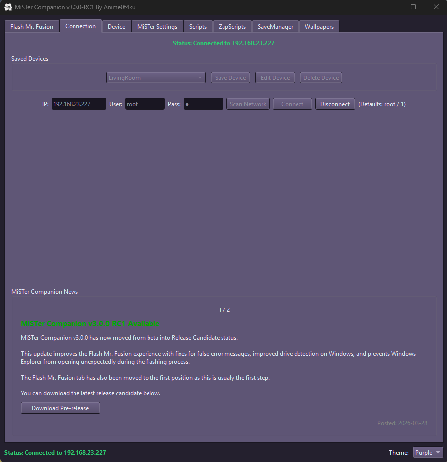

# MiSTer Companion

MiSTer Companion is a lightweight cross-platform GUI utility for managing and maintaining your MiSTer FPGA system over SSH.

It provides a simple interface for common maintenance tasks without needing to use a terminal.

Supports:

- Device management (save multiple MiSTer systems)
- Storage usage monitoring
- update_all installation and execution
- SMB enable / disable
- Open MiSTer share in file explorer
- Remote reboot

Clean, safe, and easy MiSTer management from your desktop.

---

## Requirements

Before using MiSTer Companion, make sure:

- Your MiSTer SD card is flashed with **MiSTerFusion**
- You used **Rufus** (or similar) to flash the image
- Your MiSTer is connected to your local network
- Your MiSTer has an active internet connection

Default credentials are `root / 1` (unless changed)

MiSTerFusion download:  
https://github.com/MiSTer-devel/mr-fusion/releases

Rufus download:  
https://rufus.ie/

---

## Download (Automatic Builds)

Download the latest automatic pre-release build:

| Platform | Status | Download |
|----------|--------|----------|
| Windows (x86_64) |  | [Download Windows](https://github.com/Anime0t4ku/mister-companion/releases/download/Pre-release/MiSTer-Companion-Windows-x86_64.zip) |
| Linux (x86_64) |  | [Download Linux](https://github.com/Anime0t4ku/mister-companion/releases/download/Pre-release/MiSTer-Companion-Linux-x86_64.zip) |

---

## Linux Notes

The Linux build:

- Compiled on Ubuntu (GitHub Actions)
- Works on most modern x86_64 distributions
- Does not require Python or Tkinter installed
- Requires a graphical desktop environment (X11 / Wayland)

To run:

    chmod +x MiSTer-Companion
    ./MiSTer-Companion

---

## Python Requirements (Running From Source)

If running the script directly:

- Python 3.10+
- Tkinter (usually included, may require `python3-tk` on Linux)
- paramiko
- requests

Install dependencies:

    pip install paramiko requests

Run with:

    python mister-companion.py

---

## License

This project is licensed under the **GNU General Public License v2.0 (GPL-2.0)**.

See the `LICENSE` file for full details.
