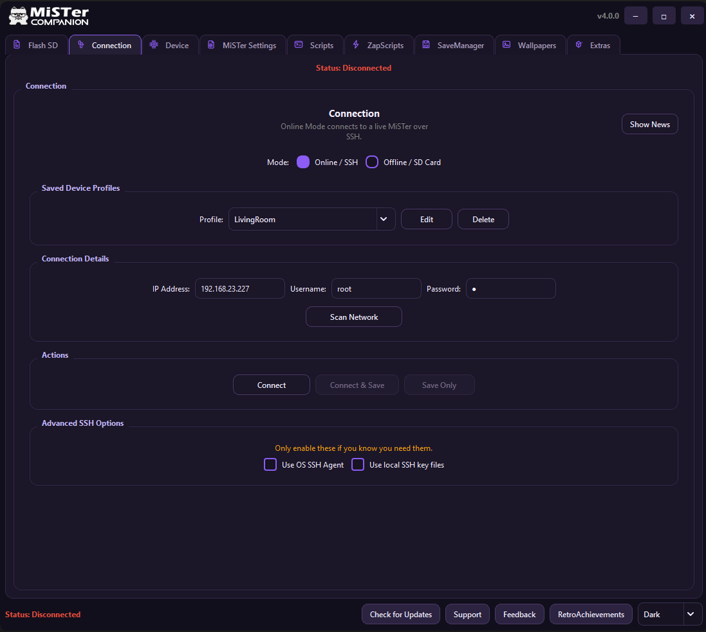

# MiSTer Companion

MiSTer Companion is a cross-platform GUI utility for managing and maintaining your MiSTer FPGA system over SSH.

It provides a simple interface for common maintenance tasks without needing to use a terminal.

---

## Versions

MiSTer Companion is currently available in two versions:

### v3 (Current – Release Candidate)
- Complete rebuild of the application using PyQt6
- Improved performance, stability, and UI
- Actively developed and will receive all future updates

### v2 (Legacy)
- Previous version of the app (Tkinter-based)
- Stable and fully functional
- No longer receives updates

New users should start with **v3**  
Existing users are encouraged to migrate over time

---

Supports:

- Device management (save multiple MiSTer systems)
- Storage usage monitoring (SD and USB)
- Edit MiSTer.ini in Easy Mode (Presets) and Advanced Mode (Manual)
- update_all installation, configuration and execution
- Zaparoo installation and setup
- ZapScripts launcher via Zaparoo Core API
- SD migration tool (migrate_sd) installer
- cifs_mount installer and config
- SMB enable / disable
- Open MiSTer share directly in the system file manager
- Remote reboot
- SSH console output for script execution
- Save Manager to backup and sync saves between multiple MiSTer devices
- Wallpaper management (multiple sources)
- Scan network for MiSTer devices
- Install Insert-Coin via update_all configurator

Clean, safe, and easy MiSTer management from Windows and Linux.

---

## Features

MiSTer Companion uses a tabbed interface to organize functionality.

### Connection
- Connect to your MiSTer over SSH
- Save and manage multiple devices
- Scan for MiSTer devices on your local network
- Automatic reconnect after reboot

### Device
- View SD card storage usage
- Detect USB storage usage
- Enable or disable SMB file sharing
- Open the MiSTer network share directly in the system file manager
- Reboot MiSTer remotely

### MiSTerSettings
- Easy Mode for simplified configuration of common MiSTer.ini settings
- Advanced Mode editor for the [MiSTer] section of MiSTer.ini
- Switch between Easy Mode and Advanced Mode
- Automatic backups before applying configuration changes
- Restore MiSTer.ini from backups or defaults

### Scripts
- Install, configure and run update_all
- Install Zaparoo
- Install migrate_sd (SD card migration utility)
- Install cifs_mount / cifs_umount
- View live SSH output when running scripts

### ZapScripts
- Run update_all via the Zaparoo Core API
- Run migrate_sd via the Zaparoo Core API
- Run Insert-Coin via the Zaparoo Core API
- Open Bluetooth menu
- Open MiSTer OSD menu
- Cycle wallpaper
- Return to MiSTer home

### SaveManager
- Create timestamped backups of MiSTer saves
- Optional savestate backups
- Automatic backup retention per device
- Restore backups to any connected MiSTer
- Sync saves between multiple MiSTer systems
- Local Sync Folder for merging newest save files

### Wallpapers
- Install wallpaper packs directly from GitHub
- Multiple wallpaper sources supported
- Automatic update detection
- Remove installed wallpapers
- Built-in SSH output log
- Quick access via SMB

---

## Requirements

Before using MiSTer Companion, make sure:

- Your MiSTer SD card is flashed with MiSTerFusion
- Your MiSTer is connected to your local network
- Your MiSTer has an active internet connection

Default credentials:

    root / 1

MiSTerFusion:
https://github.com/MiSTer-devel/mr-fusion/releases

---

## Download

Pre-built nightly binaries are generated automatically via GitHub Actions.

### v3 (Recommended)

| Platform | Status | Download |
|----------|--------|----------|
| Windows |  | [Windows x86_64 Pre-Release](https://github.com/Anime0t4ku/mister-companion/releases/download/Pre-release/MiSTer-Companion-Windows-x86_64.zip) |
| Linux |  | [Linux x86_64 Pre-Release](https://github.com/Anime0t4ku/mister-companion/releases/download/Pre-release/MiSTer-Companion-Linux-x86_64.tar.gz) |

---

## Linux Notes

Opening the MiSTer network share requires GVFS SMB support.

Ubuntu / Debian / Linux Mint

    sudo apt install gvfs-backends

Fedora

    sudo dnf install gvfs-smb

Arch Linux

    sudo pacman -S gvfs gvfs-smb

---

## Python Requirements (Running From Source)

### v3
- Python 3.10+
- PyQt6
- paramiko
- requests
- websocket-client
- psutil

Install:

    pip install PyQt6 paramiko requests websocket-client psutil

Run:

    python main.py

### v2 (Legacy)
- Python 3.10+
- Tkinter
- paramiko
- requests
- websocket-client
- psutil

Run:

    python mister-companion.py

---

## License

This project is licensed under the GNU General Public License v2.0 (GPL-2.0).

See the LICENSE file for full details.
